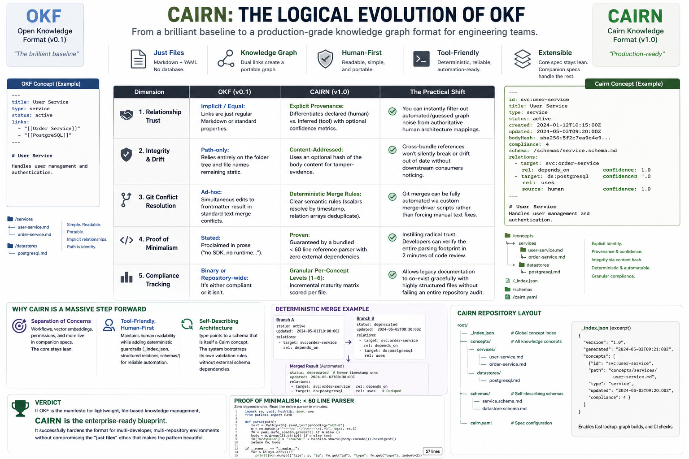

# Cairn

**A portable knowledge format — durable identity, verifiable relationships, just files.**

> Cairn v1.0 — Project-agnostic specification, examples, tools, and agent skill.

Cairn is an open standard for representing project knowledge as a directory of plain Markdown files. Each concept is one file. The file path is the concept's identity. There is no SDK, no runtime, no database, and no required service — only Markdown, YAML frontmatter, and relationships that can be inspected, queried, and verified.



## Why Cairn Exists

File-based knowledge formats solved the right problem: knowledge should live beside the systems it describes, remain readable without tooling, and work naturally with git. But first-generation formats left structural gaps:

- Links did not distinguish human-verified relationships from tool guesses.
- Path-only identity could not detect silent drift after a referenced concept changed.
- Concurrent edits to frontmatter had no deterministic merge behavior.
- Minimalism was claimed in prose, not proven with a small parser.
- Compliance was often treated as an all-or-nothing repository score.

Cairn keeps the useful part — one concept per file — and hardens it for production-scale knowledge graphs.

## What You Get

- **A core specification:** [SPECIFICATION.md](SPECIFICATION.md)
- **Self-describing schemas:** [schemas/](schemas/)
- **Examples:** [examples/](examples/)
- **Reference parsers:** [tools/reference-parser/](tools/reference-parser/)
- **Validator, indexer, and auditor:** [tools/](tools/)
- **Project migration agent:** [tools/project-agent/](tools/project-agent/)
- **Agent Skills package:** [skills/cairn-project-migration/](skills/cairn-project-migration/)
- **Migration guide:** [migration-guides/project-analysis.md](migration-guides/project-analysis.md)
- **RFC process:** [RFC/](RFC/)

## The Cairn Concept

A concept is a Markdown file with YAML frontmatter.

```yaml
---
type: schemas/concept.md
title: Payment Service
description: Handles payment authorization and settlement.
status: active
tags: [service, payments]
timestamp: 2026-06-20T00:00:00Z
hash: <optional sha256 of the body>
aliases:
  - services/billing.md
relations:
  - type: depends_on
    target: databases/payments.md
    confidence: declared
    note: Human-reviewed architecture dependency.
  - type: references
    target: APIs/checkout.md
    confidence: inferred
    note: Inferred from import CheckoutClient in src/payments/client.ts:12.
---

# Payment Service

Ordinary Markdown body.
```

Only `type` and `title` are required. Everything else increases clarity, traceability, or compliance level.

## Core Ideas

1. **One concept, one file.** The file path is identity inside a bundle.
2. **No required tooling.** A Cairn bundle remains useful with only a filesystem and text editor.
3. **Relations have provenance.** Every relation says whether it is `declared` by a human or `inferred` by a tool.
4. **Integrity is optional and verifiable.** A `hash` can verify the body content without a central registry.
5. **Renames do not break identity.** `aliases` carry old paths forward.
6. **Types are Cairn concepts.** A `type` points to a schema concept under `schemas/`.
7. **Merges are deterministic.** Relation arrays dedupe by `(type, target)`, tags union, and scalar fields resolve by timestamp.
8. **Compliance is per concept.** Cairn never collapses a repository into one compliance score.
9. **Minimalism is proven.** The core parser is under 60 lines in both Python and TypeScript.
10. **Core stays small.** Memory, embeddings, workflows, and permissions belong in companion layers, not the core format.

## Repository Layout

```text
cairn/
├── README.md
├── SPECIFICATION.md
├── schemas/
├── examples/
├── assets/
├── tools/
│   ├── validate/
│   ├── index/
│   ├── auditor/
│   ├── project-agent/
│   └── reference-parser/
├── skills/
│   └── cairn-project-migration/
├── migration-guides/
├── reports/
└── RFC/
```

## Quick Start

Validate this repository as a Cairn bundle:

```sh
python3 tools/validate/validate.py .
```

Generate a structured index with backlinks:

```sh
python3 tools/index/index.py .
```

Run a per-concept compliance audit:

```sh
python3 tools/auditor/audit.py .
```

Parse a concept with the minimal reference parser:

```sh
python3 tools/reference-parser/parser.py SPECIFICATION.md
```

## Bring A Project Up To Cairn Standard

Use the project migration agent. It scans a target project read-only by default and stages proposed Cairn concepts outside the source project.

```sh
python3 tools/project-agent/cairnize.py /path/to/project
```

Default output:

```text
cairn-runs/<project>-<timestamp>/
├── cairn-proposed/
└── reports/CAIRN_MIGRATION_<timestamp>.md
```

To write staging artifacts inside the target project, opt in explicitly:

```sh
python3 tools/project-agent/cairnize.py /path/to/project --write-into-target
```

The agent:

- detects candidate services, modules, APIs, data models, workflows, ownership files, and docs
- stages one concept per candidate
- uses `<needs author input>` when source text does not support a description
- marks generated relations as `confidence: inferred`
- cites concrete evidence in relation notes
- writes a timestamped migration report
- stops before modifying the real project knowledge base

## Agent Skills Support

This repo includes an Agent Skills-compatible package:

```text
skills/cairn-project-migration/
├── SKILL.md
├── scripts/
├── references/
├── assets/
└── evals/
```

Use it with any Agent Skills-compatible client by installing or copying the `skills/cairn-project-migration/` directory into that client's skills directory.

The skill follows the Agent Skills progressive disclosure model:

- `SKILL.md` contains concise trigger and workflow instructions.
- `references/` contains the detailed migration contract.
- `scripts/` contains the reusable scanner.
- `assets/` contains schemas needed for standalone execution.
- `evals/` contains expected behavior test cases.

## Compliance Levels

Compliance is reported per concept only.

| Level | Requirement |
|---|---|
| 1 | `type` + `title` |
| 2 | + `description`, `status`, `tags` |
| 3 | + at least one typed `relations` entry where relevant |
| 4 | + `type` resolves to an existing schema concept |
| 5 | + every relation carries `confidence`; zero broken relations or orphaned aliases |
| 6 | + `hash` present and verified against current body content |

There is no whole-bundle compliance score.

## Frequently Asked Questions

### Is Cairn a database?

No. Cairn is a file format. You can index it into a database if you want, but the bundle remains valid without one.

### Do I need the tools?

No. Tools are optional. A Cairn bundle is readable and usable as plain Markdown. The tools validate, index, audit, and migrate faster.

### Why not JSON, RDF, or a graph database?

Cairn optimizes for repository-native knowledge: reviewable diffs, git history, simple files, and human readability. It can be exported to graph systems, but it does not require them.

### What is relation provenance?

Every relation has `confidence: declared | inferred`. `declared` means a human asserted the relation. `inferred` means a tool derived it from evidence such as an import, foreign key, route, or config dependency.

### What does the optional hash protect?

`hash` is the SHA-256 digest of the concept body, excluding frontmatter. It lets consumers detect drift or tampering after a concept is referenced.

### Can I rename a concept?

Yes. Move the file and add the old path to `aliases`. Consumers can resolve references to old paths through aliases.

### Can I add embeddings, memory, workflows, or permissions?

Not in core. Put those in companion specifications that reference Cairn concepts by path or `cairn://` URI.

### How do merges work?

Frontmatter has deterministic merge rules. Relations dedupe by `(type, target)`, tags union, aliases union, and scalar fields resolve by the later `timestamp`.

### Is OKF required?

No. Cairn is standalone. It borrows the useful file-based idea and adds relation provenance, integrity, deterministic merges, and proof of minimalism.

### Can this be used in any language or project type?

Yes. Cairn concepts are plain files. The migration agent detects common project signals across many ecosystems, but the format itself is project-agnostic.

## Governance

Spec changes go through [RFC/](RFC/). RFCs are Cairn concepts with `type: schemas/rfc.md`. A proposal is `draft` until accepted, then `active`.

## License

MIT. See [LICENSE](LICENSE).
